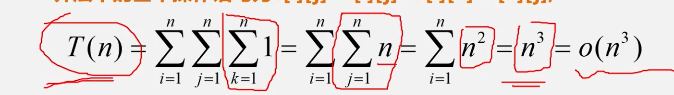
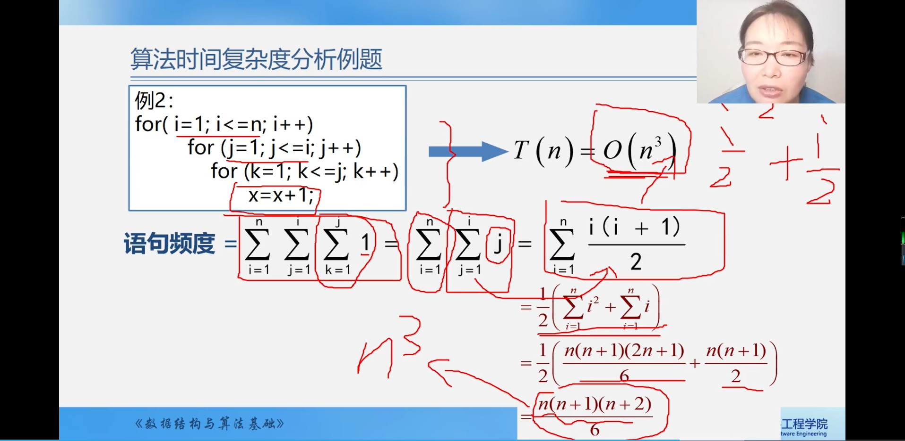
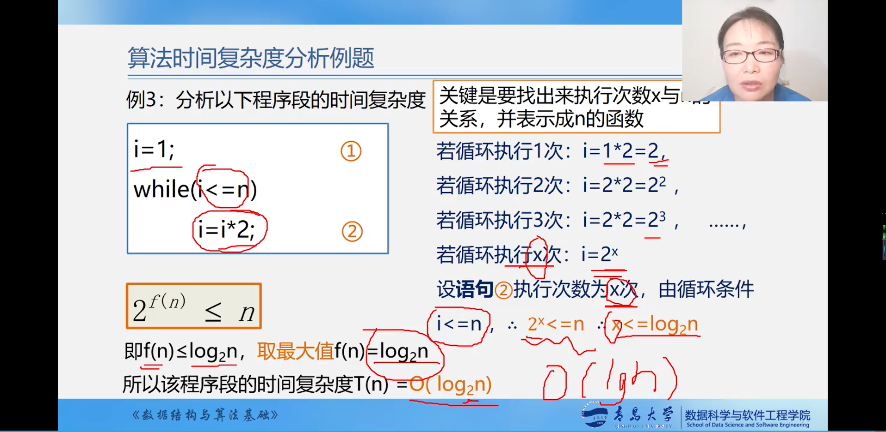
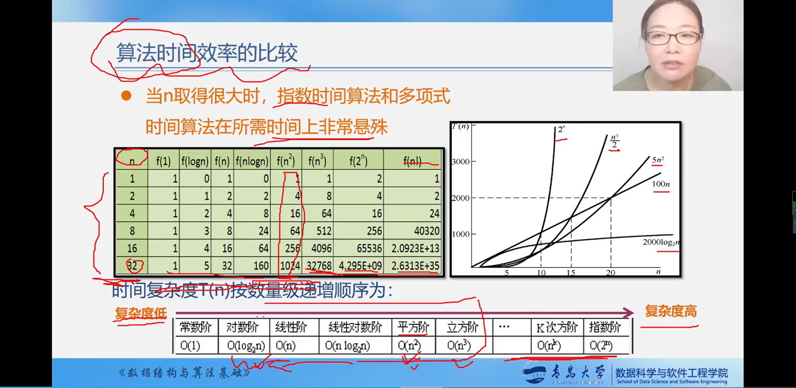
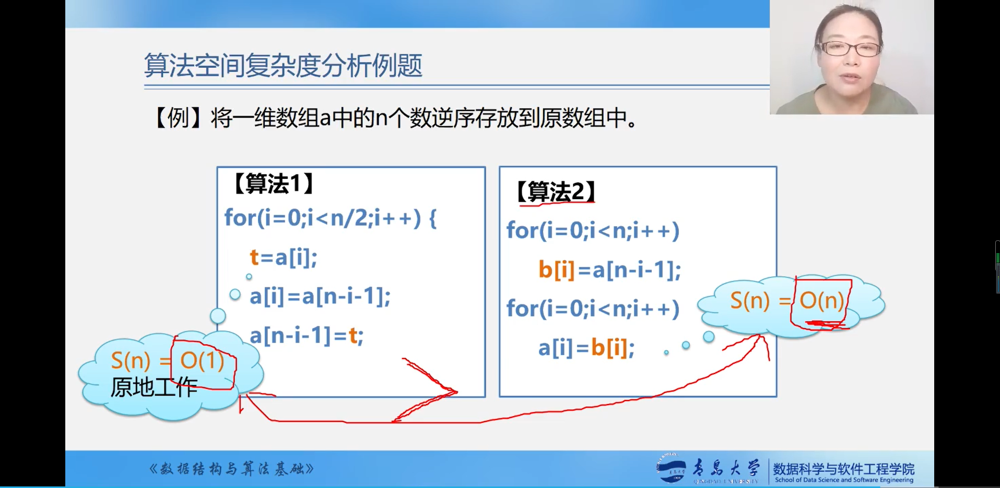
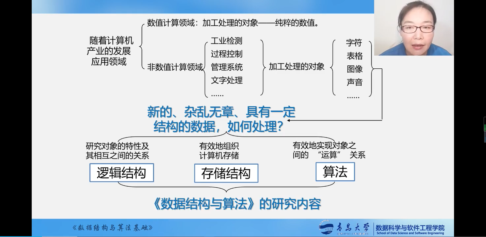
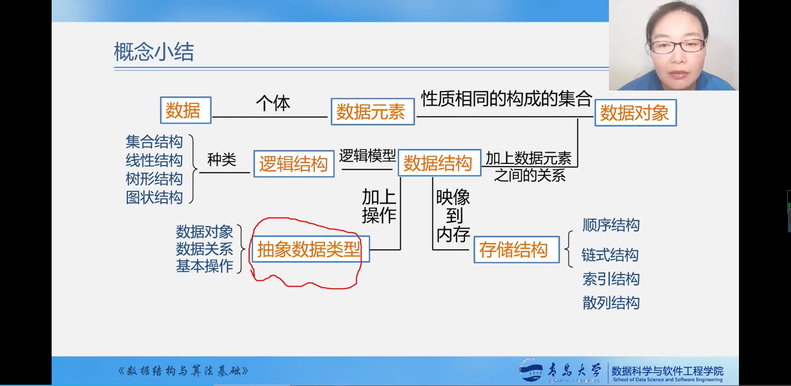
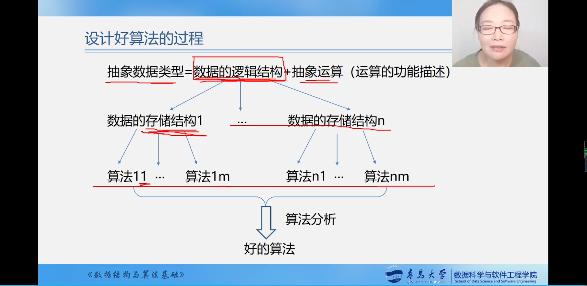

# :page_with_curl:绪论
[数据](#one数据)|[数据元素和数据项](#two数据元素和数据项)|[数据对象](#three数据对象)|[数据结构](#four数据结构)|[数据类型和抽象数据类型](#five数据类型和抽象数据类型)|[算法和算法分析](#six算法和算法分析)|[总结](#seven总结)
---|---|---|---|---|---|---|
## :one:数据
<details>
<summary> 

**数据**
</summary>

  * 是能输入计算机且能被计算机处理的`各种符号的集合`
    * 信息的载体
    * 是对客观事物符号化的表示
    * 是能够被计算机识别、存储、和加工
  * 包括
    * 数值型的数据:整数、实数等
    * 非数值型的数据；文字、图像、图形、声音等
</details>

## :two:数据元素和数据项
<details>
<summary>

  **数据元素**</summary>
  * 是数据的`基本单位`，在计算机中通常作为一个整体进行考虑和处理
  * 也简称为元素，或称为记录、结点或顶点</details>
<details>
<summary>

  **数据项**</summary>
  * 构成数据元素的不可分割的最小单位
* 数据、数据元素、数据项三者之间的关系
    * 数据 > 数据元素 > 数据项
        例如：学生表 > 个人记录 > 学号、姓名....
        </details>

## :three:数据对象
<details>
<summary>

**数据对象**</summary>
  * 是`性质相同的数据元素的集合`，是数据的一个子集
    例如：
    * `整数`数据对象是集合N={0,1,2....}
    * `字母字符`数据对象是集合C={'A','B','C'....}
    * `学籍表`也可以看作一个数据对象</details>
<details>
<summary>

  **数据元素与数据对象**</summary>
  * 数据元素——组成数据的基本单位
    * 与数据的关系：是集合的个体
  * 数据对象——性质相同的数据元素的集合
    * 与数据的关系
    * 是集合的子集</details>
## :four:数据结构
<details>
<summary>

**数据结构**</summary>
  * 数据元素之间不是孤立存在的，他们之间存在着某种关系，数据元素之间的关系称为 `结构`
  * 是指`相互之间存在一种或多种特定关系`的数据元素集合</details>
<details>
<summary>

**数据结构内容**</summary>
  * 数据元素之间的逻辑关系，也称为`逻辑结构`
  * 数据元素及其关系在计算机内存中的表示（又称为映像），称为数据的`物理结构`或数据的`存储结构`
  * 数据的`运算和实现`，及对数据元素可以施加的操作以及这些操作在相应的存储结构上的实现</details>
<details>
<summary>

**数据结构的两个层次**</summary>
  * 逻辑结构
    * 描述数据元素之间的逻辑关系
    * 与数据的存储无关，独立于计算机
    * 是从具体问题抽象出来的数据模型
  * 物理结构（存储结构）
    * 数据元素及其关系在计算机存储器中的结构（存储方式）
    * 是数据结构在计算机中的表示
  * 逻辑结构与存储结构的关系：
    * 存储结构是逻辑关系的映像与元素本身的映像
    * 逻辑结构是数据结构的抽象，存储结构是数据结构的实现
    * 两者综合起来建立了数据元素之间的结构关系
  * 逻辑结构的种类
    * 划分方式一
      1. 线性结构
    有且仅有一个开始和一个终端结点，并且所有结点都最多有一个直接前趋和一个直接后继
    例如：线性表、栈、队列、串
      1. 非线性结构
    一个结点可能有多个直接前趋和直接后继
    例如：树、图
  
     * 划分方式二
        1. 集合结构：结构中的数据元素之间除了`同属于一个集合`的关系外，无任何其他的关系
        2. 线性结构：结构中的数据元素之间存在着`一对一`的线性关系
        3. 树形结构：结构中的数据元素之间存在着`一对多`的层次关系
        4. 图状结构或网状结构：结构中的数据元素之间存在着`多对多`的任意关系
  * 存储结构的种类
    * 顺序存储结构
        1. 用一组`连续`的存储单元`依次`存储数据元素，数据元素之间的逻辑关系由元素的`存储位置`来表示
        2. C语言中用数组来实现顺序存储结构
    * 链式存储结构
        1. 用一组`任意`的存储单元存储数据元素，数据元素之间的逻辑关系用`指针`来表示
        2. C语言中用指针来实现链式存储结构
     * 索引存储结构
        1. 在存储结点信息的同时，还建立附加的`索引表`
        2. 索引表中的每一项称为一个`索引项`
        3. 索引项的`一般形式`是：（关键字，地址）
        4. 关键字是能`唯一标识`一个结点的那些数据项
        5. 若每个结点在索引表中都有一个索引项，则该索引表称之为`稠密索引（Dense Index）`。若一组结点在索引表中只对应一个索引项，则该索引项称之为`稀疏索引（Spare Index）`
      * 散列存储结构
        根据结点的关键字直接计算出该节点的存储地址</details>
## :five:数据类型和抽象数据类型
<details>
<summary>

**数据类型（Data ype）**</summary>
* 定义：数据类型是一组性质相同的`值的集合`以及定义于这个值集合上的`一组操作`的总称
  * `数值类型=值的集合+值集合上的一组操作`
* 作用：约束变量或常量的`取值范围`，约束变量或常量的`操作`</details>
<details>
<summary>

**抽象数据类型（Abstract Data Type，ADT）**</summary>
* 是指一个数学模型以及定义在此数学模型上的一组操作
  * 由用户定义，从问题抽象出`数据模型`（逻辑结构）
  * 还包括定义在数据模型上的一组`抽象运算`（相关操作）
  * 不考虑计算机内的具体存储结构与运算的具体实现算法
* 抽象数据类型的形式定义
    ```
   抽象数据类型可用（D,S,P）三元组表示
   其中:D是数据对象;
        S是D上的关系集；
        P是对D的基本操作集
    ```
* 一个抽象数据类型的定义格式
    ```
    ADT 抽象数据类型名{
      数据对象：<数据对象的定义>
      数据关系：<数据关系的定义>
      基本操作：<基本操作的定义>
    }
    ```
    其中：
    * 数据对象、数据关系的定义用伪代码描述
    * 基本操作的定义格式为：
      * 基本操作名（参数表）
      * 初始条件：<初始条件描述>
      * 操作结果：<操作结果描述>
    * 基本操作定义格式说明
      * 参数表：`赋值参数` 只为操作提供输入值 ，`引用参数` 以&打头，除可提供输入值以外，还将返回操作结果 
      * 初始条件：描述操作执行前数据结构和参数应满足的条件，若不满足，则操作失败，并返回相应出错信息。若初始条件为空，则省略之
      * 操作结果：说明操作正常完成之后，数据结构的变化状况和应返回的结果</details>
<details>
<summary>

**抽象数据类型的表示与实现例子**</summary>
```c
typeof struct
{
    float realpart;                                        // 实部
    float imagpart;                                        // 虚部
} Complex void assign(Complex *A, float real, float imag); // 赋值
{
    A->realpart = real; // 实部赋值
    A->imagpart = imag; // 虚部赋值
}
void add(Complex *A, Complex B, Complex C)
{
    c->realpart = A.realpart + B.realpart; // 实部相加
    c->imagpart = A.imagpar + B.imagpart;  // 虚部相加
}
```
</details>

## :six:算法和算法分析
<details>
<summary>

**算法的定义**</summary>
* 对特定问题`求解方法和步骤`的一中描述，他是`指令`的有限`序列`。其中每个指令表示一个或多个操作</details>
<details>
<summary>

**算法的描述**</summary>
* 自然语言：英语、中文
* 流程图：传统流程图、NS流程图
* 伪代码：类C语言
* 程序代码：C语言程序、JAVA程序.....</details>
<details>
<summary>

**算法与程序**</summary>
* `算法`是解决问题的一种方法或一个过程，考虑如何将输入转换成输出，一个问题可以有多种算法
* `程序`是用某种程序设计语言对算法的具体实现
   ```
  程序 = 数据结构 + 算法
  数据结构通过算法实现操作
  算法根据数据结构设计程序
  ``` 
  </details>
  <details>
<summary>

**算法特性**</summary>
* 有穷性：一个算法必须总是在执行有穷步结束之后，且每一步都在有穷时间内完成
* 确定性：算法中的每一条指令必须有确切的含义，没有二义性，在任何条件下，只有唯一一条执行路径，即对于相同的输入只能得到相同的输出
* 可行性：算法是可执行的，算法描述的操作可以通过已经实现的基本操作执行有限次来实现
* 输入：一个算法有`零个`或多个输入
* 输出：一个算法有`一个`或多个输出
</details>

  <details>
<summary>

**算法设计的要求**  </summary>
* 正确性（Correctness）
  * 算法满足问题要求，能正确解决问题 
    * 算法转化为程序后要注意：
      1. 程序中`不含语法错误`
      2. 程序对于`几组输入数据`  能够得到满足要求的结果
      3. 程序对于`精心选择的、典型、苛刻且带有刁难性`的几组输入数据能够得出满足要求的结果
      4. 程序对于`一切合法的输入数据`都能够得出满足要求的结果

    通常以`第三层`意义上的正确性作为衡量一个算法是否合格的标准
* 可读性（Readability）
  *  算法主要是为了人的阅读和交流，其次才是为计算机执行，因此算法应该易于人的理解
  *  另一方面，晦涩难懂的算法易于隐藏较多错误而难以调试
* 健壮性（Robustness）
  * 指当`输入非法数据`时，算法恰当的做出反应或进行相应处理，而不是产生莫名其妙的输出结果
  * 处理错误的方法，不应是中端程序的执行，而应是返回一个表示错误或者错误性质的值，以便在更高抽象层次上进行处理
* 高效性（Efficency）
  * 花费尽量少的时间和尽量低的存储需求</details>
<details>
<summary>

**算法分析**</summary>
* 一个好的算法首先要具备正确性，然后是健壮性，可读性，在几方面都满足的情况下，主要考虑`算法的效率`，通过算法的效率高度来评判不同的算法的优劣程度
  * 算法效率以下两个方面来考虑：
    * 时间效率：指算法所耗费的时间
    * 空间效率：指算法执行的过程中所耗费的存储空间
      >时间效率和空间效率有时候是矛盾的   
* 算法时间效率的度量
  * 算法时间效率可以用依据该算法编制的程序在计算机上执行`所消耗的时间`来度量
  * 两种度量方法
    * 事后统计
      * 将算法实现，测算其时间和空间开销
      * 缺点：编写程序实现算法将花费较多的时间和精力；所得实验结果依赖于计算机的软硬件等环境因素，掩盖算法本身的优势
    * 事前分析
      * 对算法所消耗资源的一种估算方法 
  * 事前分析方法
    *  一个算法的运行时间是指一个算法在计算机上运行所耗费的时间大致可以等与计算机执行一种简单的操作（如赋值、比较、移动）所需要的`时间`与算法中进行的简单次数`乘积`
        >算法运行时间 = 一个简单操作所需的时间 $\times$ 简单操作次数

    * 也即算法中的每条语句频度之和
         >算法运行时间 = 每条语句的执行次数  该语句执行一次所需要的时间

       每条语句的执行次数又称`语句频度`
      >算法运行时间 = 语句频度  该语句执行一次所需要的时间
    
    * 每条语句执行一次所需时间，一般是随机器而异的。取决于机器的指令性能、速度以及编译的代码质量。是由机器本身软硬件环境决定的，他与算法无关，所以
      >算法运行时间由 语句频度来代表
    * 例如：两个n*n的矩阵相乘的算法可描述为
        ```c++
        for (i = 1; i < = n; i++)    // n+1次
            for (j = 1; j <= n; j++) // n*n+1次
            {
                c[i][j] = 0;
                for (k = 0; k < n; k++) // n*n*n+1次
                    c[i][j] = c[i][j] + a[i][k] * b[k][j]; // n*n*n次
            }
        ```
    我们把算法所耗费的时间定义为`改算法中每条语句的频度之和`，则上述算法的时间消耗T(n)为：
      >T(n)=2n^3 + 3n^2 + 2n + 1
   * 算法时间复杂度的渐进表示法
     *  为了便于比较不同算法的时间效率，我们仅比较他们的数量级
     *  若有某个辅助函数法f(n),使得当n趋近于无穷大时，T(n)/f(n)的极限值为`不等于零的常数`,则称f(n)是T(n)的同数量级函数。记作 T(n)=O(f(n)) ,称 O(f(n)) 为`算法的渐进复杂度`(O是数量级的符号)，简称`时间复杂度`。
     *  上述例子的渐进时间复杂度为
        > T(n) = O(n^3)
    * 分析算法时间复杂度的基本方法
      * 找出`语句频度最大`的那条语句作为`基本语句`
      * 计算`基本语句`的频度得到问题规模n的某个函数f(n)
      * 取其数量级用符号"O"表示
        >时间复杂度是由嵌套最深层语句的频度决定的
      * 算法时间复杂度分析例题
例一：
        ```c++
        for (i = 1; i < = n; i++)    // n+1次
            for (j = 1; j <= n; j++) // n*n+1次
            {
                c[i][j] = 0;
                for (k = 0; k < n; k++) // n*n*n+1次
                    c[i][j] = c[i][j] + a[i][k] * b[k][j]; // n*n*n次
            }
        ```
              > 算法中的基本操作语句为c[i][j] = c[i][j] + a[i][k] * b[k][j]
          
          例二：
           ```c++
          for (i = 1; i <= n; i++)
          {
              for (j = 1; j <= i; j++)
              {
                  for (k = 1; k <= j; k++)
                      x = x + 1;
              }
          }
        ```
        
        例三：
         ```c++
          i = 1;
        while (i <= n)
        {
            i = i * 2;
        }
        ```
        
    * 算法时间复杂度计算
      >有的情况下，算法中基本操作重复执行的次数还随问题的`输入数据集`不同而不同
      ```c++
      for(i=0;i<n;i++)
      {
          if (a[i] == e)
              return i + 1;
          return 0;
      }
      // 最好情况：1 次
      // 最坏情况：n
      // 平均时间复杂度为：O(n)
      ```
    * 算法时间复杂度
      *  最坏时间复杂度：指在最坏情况下，算法的时间复杂度
      *  平均时间复杂度：指在所有可能输入实例在等概率出现的情况下，算法的期望运行时间
      *  最好时间复杂度：指在最好情况下，算法的时间复杂度
       >一般总是考虑在最坏的情况下的时间复杂度，以保证算法的运行时间不会比它更长
       对于复杂的算法，可以将它分为几个容易估算的部分，然后利用大O的加法和乘法法则，计算算法的时间复杂度
       a) 加法规则
        T(n) = T1(n) + T2(n) = O(f(n)) + O(g(n)) = O(max(f(n),g(n)))
        b)乘法规则
        T(n)=T1(n) * T2(n)= O(f(n)) * O(g(n)) = O(f(n)*g(n))

    * 算法时间效率的比较
  
* 渐进空间复杂度
  * 空间复杂度：算法所需存储空间的度量，记作`S(n) = O(f(n))`,其中`n`为问题的规模（或大小）
  * 算法要占据的空间
    * 算法本身要占据的空间，输入/输出，指令，常数，变量等
    * 算法要使用的`辅助空间`
  * 算法空间复杂度例题
  </details>
## :seven:总结
<details>
<summary>

**《数据结构与算法》的研究内容**</summary>

</details>
<details>
<summary>

**概念小结**</summary>
</details>
<details>
<summary>

**算法小结**</summary>
</details>