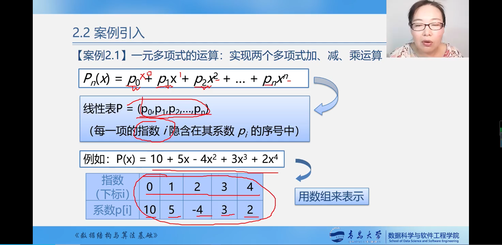
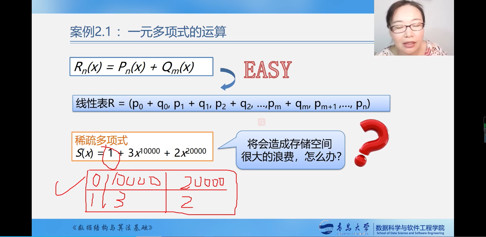
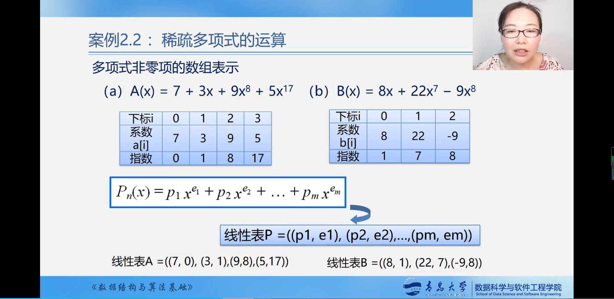
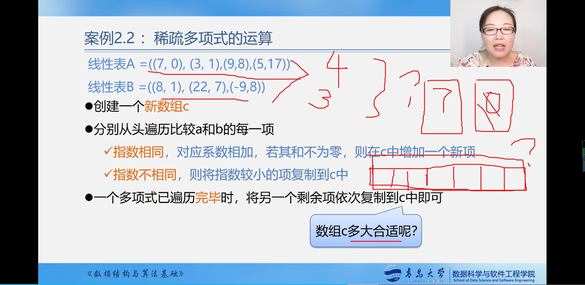
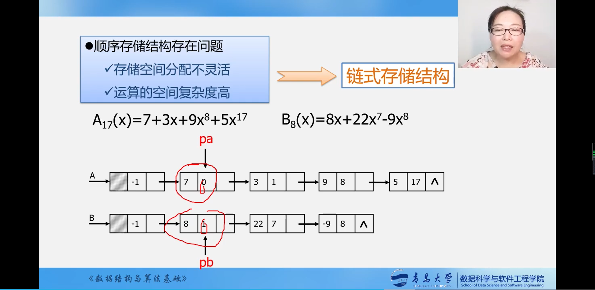
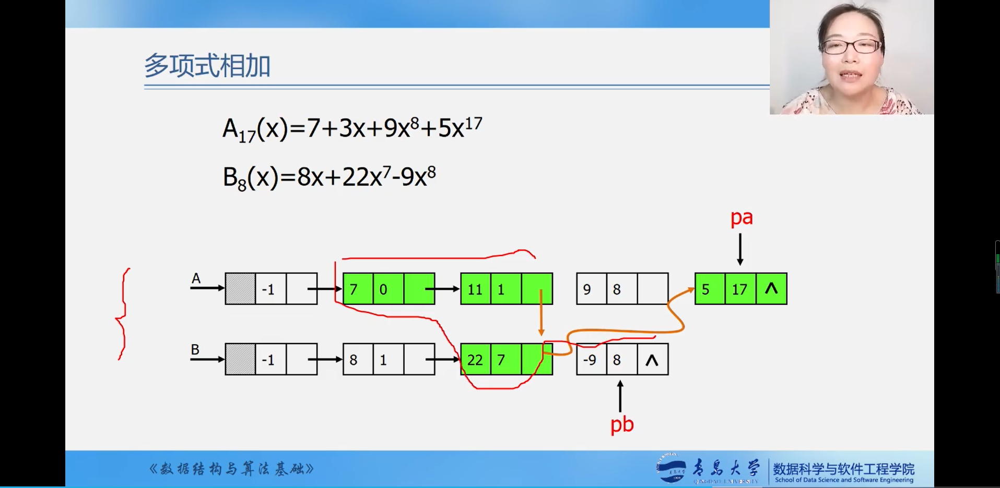
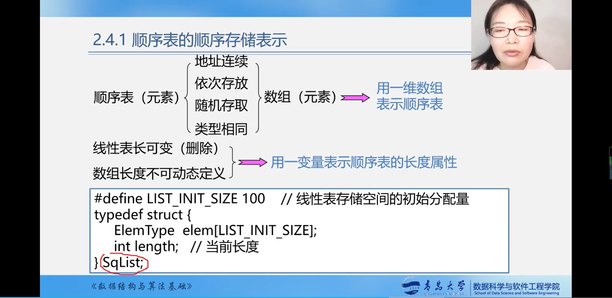
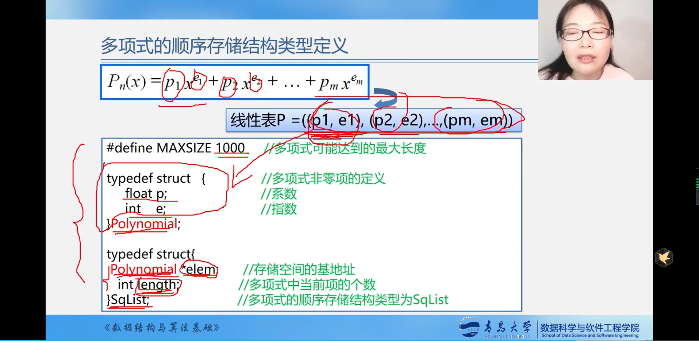
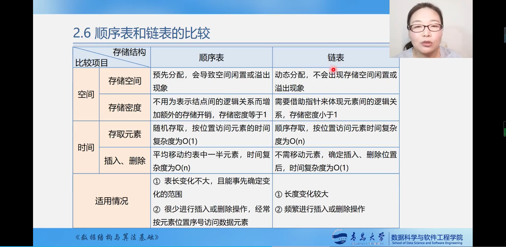
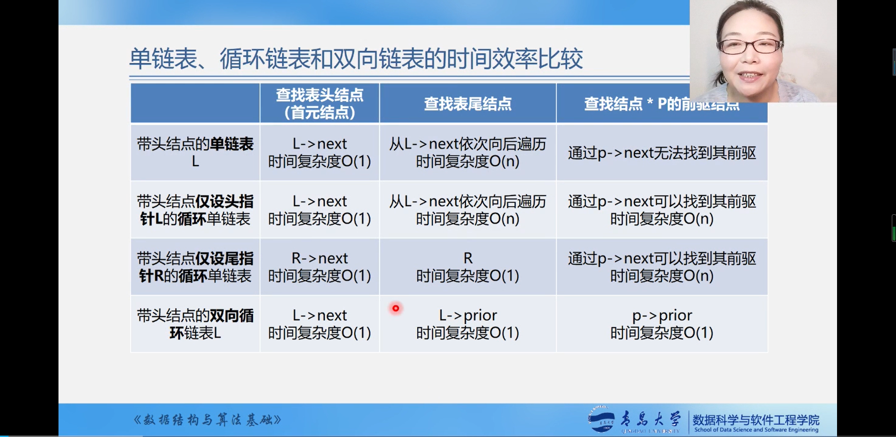

# :page_with_curl:线性表
[:clock1:线性表的定义与特点](#one线性表的定义与特点)|[:clock2:线性表的类型定义](#two线性表的类型定义)|[:clock3:线性表的顺序表示和实现](#three线性表的顺序表示和实现)|[:clock4:类C语言有关操作补充](#four类c语言有关操作补充)|[:clock5:顺序表基本操作的实现](#five顺序表基本操作的实现)|[:clock6:线性表的链式表示和实现](#six线性表的链式表示和实现)|[:clock7:单链表基本操作实现](#seven单链表基本操作实现)|[:clock8:循环链表](#eight循环链表)|[:clock9:双向链表](#nine双向链表)|[:clock10:线性表的应用](#onezero线性表的应用)|[:clock11:总结](#oneone-总结)
---|---|---|---|---|---|---|---|---|---|---|
## :one:线性表的定义与特点
<details>
<summary> 

**线性表（Linear List）**</summary>
*  由`n(n>=0)`个数据元素（结点）a1,a2,....an组成的`有限序列`
   *  其中数据元素的个数n定义为表的`长度`
   *  当n=0时称为`空表`
   *  将非空的线性表（n>0）记作：（a1,a2...an）
   *  这里的数据元素ai（1<=i<=n）只是一个抽象符号，其具体含义在不同情况下可以不同
</details> 
<details>
<summary> 

**线性表的特点**</summary>
* 同一线性表的元素必定具有相同特性，数据元素间的关系是线性关系
</details> 
<details>
<summary>

**线性表的逻辑特征**</summary>
* 在非空的的线性表，有且仅有一个开始结点a1，它没有直接前趋，而仅有一个直接后继
* 有且仅有一个终端结点an，它没有直接后继，而仅有一个直接前趋an-1
* 其余的内部结点ai（2<=i<=n-1）都有且仅有一个直接前趋ai-1和一个直接后继ai+1
</details>
<details>
<summary>

**顺序存储案例引入** </summary>
* 案例一

* 案例二
 
* 顺序存储结构存在问题
  * 存储空间分配不灵活
  * 运算的空间复杂度高
</details>
<details>
<summary>

**链式存储案例引入**</summary>

</details>
<details>
<summary>

**总结**</summary>
* 线性表中的数据元素的类型可以为`简单类型`，也可以为`复杂类型`
* 许多实际应用问题所涉及的基本操作有很大相似性，不应为每个具体应用单独编写一个程序
* 从具体应用中抽象出共性的`逻辑结构和基本操作`(抽象数据类型)，然后实现其`存储结构和基本操作`
</details>

## :two:线性表的类型定义
<details>
<summary>

**抽象数据类型线性表的定义**</summary>
   ```c++
   ADT List
   {
    数据对象：D={ai| ai属于Elemset，（i=1,2,...n）n>=0}
    数据关系：R={<ai-1,ai> | ai-1,ai属于D，（i=1,2,....,n）}
    基本操作：
    InitList(&L);
    DestroyLIst(&L);
    ListINsert(&L,i,e);
    ListDelete(&L,i,e);
   }ADT List 
   ```
   </details>
   <details>
<summary>

   **基本操作（一）** </summary>
* `InitList(&L)(initialzation List)`
  * 操作结果：构造一个线性表
* `DestroyList(&L)`
  * 初始条件：线性表L已经存在
  * 操作结果：销毁线性表
* `ClearList(&L)`
  * 初始条件：线性表L已经存在
  * 操作结果：将线性表重置为空表
 </details>
    <details>
<summary>

**基本操作（二）**</summary>
* `ListEmpty(L)`
  * 初始条件：线性表L已经存在
  * 操作结果：若线性表L为空表，则返回TURE;否则返回FALSE
* `ListLength（L）`
  * 初始条件：线性表L已经存在
  * 操作结果：返回线性表L中的数据元素个数
</details>
 <details>
<summary>

**基本操作（三）**</summary>
* `GetElem(L,i,&e)`
  * 初始条件：线性表L已经存在，1<=i<=ListLength(L)
  * 操作结果：用e返回线性表L中第i个元素的值
* `LocateElem(L,e,compare())`
  * 初始条件：线性表L已经存在，compare()是数据元素判定函数
  * 操作结果：返回L中第1个与e满足compare()的数据元素的位序，若这样的元素不存在则返回值0
</details>
 <details>
<summary>

**基本操作（四）**</summary>
* `PriorElem(L,cur_e,&pre_e)`
  * 初始条件：线性表L已经存在
  * 操作结果：若cur_e是L的数据元素，且不是第一个，则用pre_e返回它的前趋，否则操作失败；pre_e无意义
* `NextElem(L,cur_e,&next_e)`
  * 初始条件：线性表L已经存在
  * 操作结果：若cur_e是L的数据元素，且不是最后一个，则用next_e返回它的后继，否则操作失败，next_e无意义
</details>
 <details>
<summary>

**基本操作（五）**</summary>
* `ListInsert(&L,i,e)`
  * 初始条件：线性表L已经存在，1<=i<=ListLen(L)+1
  * 操作结果：在L的第i个位置之前插入新的数据元素e，L的长度加一
* `ListDelete(&L,i,&e)`
  * 初始条件：线性表L已经存在，1<=i<=ListLength(L)
  * 操作结果：删除L的第i个数据元素，并用e返回其值，L的长度减一
</details>
 <details>
<summary>

**基本操作（六）**</summary>
* `ListTraverse(&L,visited())`
  * 初始条件：线性表L已经存在
  * 操作结果：依次对线性表中每个元素调用visited()
</details>

## :three:线性表的顺序表示和实现
 <details>
<summary>

**线性表的顺序存储表示**</summary>
   * 线性表的顺序存储表示又称为`顺序存储结构`和`顺序映像`
   * 顺序存储结构
      * 定义：
         *  把逻辑上相邻的数据元素存储在物理上相邻的存储单元中的存储结构
     *  线性表的第一个数据元素a1的存储位置，称作线性表的`起始位置`或`基地址`
      *  线性表顺序存储结构`占用一片连续的存储空间`。知道某个元素的存储位置就可以计算其他元素的存储位置
         *  每个元素占`l`个存储单元，则第i+1个元素的存储位置和第i个数据元素的存储位置之间满足关系：`LOC(ai+1)=LOC(ai)+l`
         *  所有元素的存储位置均可由第一个数据元素的存储位置得到`LOC(ai)=LOC(a1)+(i-1)*l`
 </details>
 <details>
<summary>
 
**线性表的顺序实现**</summary>


 </details>

## :four:类C语言有关操作补充
 <details>
<summary>

**顺序表类型定义**</summary>
```c++
typedef struct{
   ElemType data[];
   int length;
}SqList
```
上述中的`ElemType`相当于给数据类型起别名与原数据类型等价
例如：`typedef char ElemType` `typedef int ElemType`
</details>
 <details>
<summary>

**数组定义**</summary>
* 数组静态分配
   ```c++
   typedef struct{
      ElemType data[MaxSize];
      int length;
   }SqList;
   ```
* 数组动态分配
   ```c++
   typedef struct{
      ElemType *data;
      int length;
   }Sqlist;
   ```
  * c语言中的内存动态分配 `L.data=(ElemType*)malloc(sizeof(ElemType)*MaxSize)` 
    * `malloc(m)`函数，开辟m字节长度的地址空间，并返回这段地址的首地址
    * `sizeof(x)`函数,计算变量x的长度
    * `free(p)`函数，释放指针p所指变量的存储空间，即彻底删除一个变量
    * 需要加载头文件：<stdlib.h>
  * c++中的内存动态分配 `L.data=new ElemType[Maxsize] `
</details>

## :five:顺序表基本操作的实现
 <details>
<summary>

**线性表的初始化**</summary>
```c
typedef int Status; // Status为返回状态
#define OVERFLOW -2;
#define OK 1;
#define ERROR -1;
Status InitList_Sq(Sqlist &L) // 构造一个线性表
{
    L.elem = new ElemType[MaxSize]; // 为顺序表分配空间
    if (!L.elem)
        exit(OVERFLOW); // 存储分配失败
    L.length = 0;       // 空表长度为0
    return OK；
}
```
</details>
 <details>
<summary>

**销毁线性表**</summary>
```c
void DestroyList(SqList &L)
{
   if(L.elem)
   delete L.elem; // 释放存储空间
}
```
</details>
 <details>
<summary>

**清空线性表**</summary>
```c
void ClearList(Sqlist &L)
{
   L.length=0; //将线性表的长度置为0
}
```
</details>
 <details>
<summary>

**求线性表的长度**</summary>
```c
int GetLength(Sqlist L)
{
   return (L.length);
}
```
</details>
 <details>
<summary>

**判断线性表L是否为空**</summary>
```c
int IsEmpty(Sqlist L)
{
   if(L.length==0)
   return 1;
   return 0;
}
```
</details>
 <details>
<summary>

**顺序表的取值**</summary>
```c
int GetElem(Sqlist L, int i, ElemType &e)
{
    if (i < 1 || i > L.length)
        return ERROR;  // 判断i值是否合理，若不合理，返回ERROR
    e = L.elem[i - 1]; // 第i-1的单元存储着第i个数据
    return OK;
}
```
</details>
 <details>
<summary>

**顺序表上的查找**</summary>
```c
int LocateElem(Sqlist L, ElemType e)
{
    // 在线性表L中查找值为e的数据元素，返回其序号（是第几个元素）
    for (int i = 0; i < L.length; i++)
        if (L.elem[i] == e) // 查找成功，返回序号
            return i + 1;
    return 0; // 查找失败，返回0
}
```
平均查找长度为 ASl =  =1/n   =n+1/2
</details>
 <details>
<summary>

**顺序表上的插入**</summary>
```c
Status ListInsert_Sq(SqList &L, int i, ElemType e)
{
    if (i < 1 || i > length + 1)
        return ERROR; // i值不合法
    if (L.length == MaxSize)
        return ERROR; // 当前存储空间已满
    for (j = L.length - 1; j > i - 1; j--)
        L.elem[j + 1] = L.elem[j]; // 插入位置及之后的元素后移
    L.elem[i - 1] = e;
    L.length++;
    return OK;
}
```
平均查找长度为 Eins=1/n+1 =1/n+1(n+...+1+0)=1/n+1 * n(n+1)/2=n/2
时间复杂度为`O(n)`
</details>
 <details>
<summary>

**顺序表上的删除**</summary>
```c
Status ListDelete_Sq(SqLisr &L, int i)
{
    if (i < 1 || i > L.length) // 判断是否合法
        return ERROR;
    for (j = i; j <= L.length - 1; j++)
    {
        L.elem[j - 1] = L.elem[j]; // 被删元素前移
        L.length--; // 表长减1
        return OK;
    }
}
```
平均查找长度为 ASl =  =1/n   =n-1/2
时间复杂度为`O(n)`
</details>

## :six:线性表的链式表示和实现
<details>
<summary>

**概念**</summary>
  * 用一组`物理位置任意的存储单元`来存放线性表的数据元素
  * 这组存储单元既可以是`连续`的，也可以是`不连续`的，甚至是零散分布在内存中任意位置上的
  * 链表中元素的`逻辑次序和物理次序不一定相同`
</details>
 <details>
<summary>

**与链式存储有关的术语**</summary>
* 结点
  * 数据元素的存储映像。由数据域和指针域两部分组成
* 链表：
   * n个结点由`指针链`组成一个链表。它是线性表的链式存储映像，称为线性表的链式存储结构
* 单链表、双链表、循环链表
  * 结点只有一个指针域的链表，称为`单链表`或线性链表
  * 结点有两个指针域的链表，称为`双链表`
  * 首尾相接的链表称为`循环链表`
* 头指针、头结点、首元结点
  * `头指针`是指向链表中第一个结点的指针
  * `首元结点`是指向链表中存储第一个数据元素a1的节点
  * `头结点`是在链表的首元结点之前附设的一个结点
    * 链表可分为`带头结点`和`不带头结点`两类
* 表示空表
  * 无头结点时，`头指针为空`时为空表
  * 有头结点时，`当头结点的指针域为空时`表示空表
* 设置头结点的好处
  *  便于`首元结点`的处理
      >首元结点的地址保存在头节点的指针域中，所以在链表的第一个位置上的操作和其他位置一致，无需进行特殊处理
   
  * 便于`空表和非空表`的统一处理
    >无论链表是否为空，头指针都是指向头结点的非空指针，因此空表和非空表的处理也就统一了

* 头结点的数据域内装的是什么
  * 头结点的数据域可以为空，也可以存放线性表`表长度`等附加信息，但此节点不能计入链表长度值
 </details>
 <details>
<summary>

**链表（链式存储结构）的特点**</summary>
* 结点在存储器中的位置是任意的，即逻辑上相邻的数据元素在物理上不一定相邻
* 访问时只能通过头指针进入链表，并通过每个结点的指针域依次向后顺序扫描其余节点，所以寻找第一个结点和最后一个结点所花费的时间不等
* 这种存储元素的方法被称为`顺序存取法`
 </details>
 <details>
<summary>

**单链表的定义**</summary>
```c
typedef struct Londe
{                       // 声明结点的类型和指向结点的指针类型
    ElemType data;      // 结点的数据域
    struct Lnode *next; // 结点的指针域
} Londe, *LinkList       // *LinkList为指向结构体Lnode的指针类型
// 定义链表L：LinkList L;
// 定义结点指针p：LNode *p;
```
 </details>

## :seven:单链表基本操作实现
 <details>
<summary>

**单链表的初始化**</summary>
```c
Status InitList_L(LinkList &L)
{
    L=new Lnode;
    L->next=NULL;
    return OK;
}
```
</details>
 <details>
<summary>

**判断头结点指针域是否为空**</summary>
```c
int ListEmpty(LinkList L) // 若L为空表，则返回1，否则返回0
{
    if(L->next)
        return 0;
    else
        return 1;
}
```
</details>
 <details>
<summary>

**单链表的销毁**</summary>
```c
Status DestroyList_L(LinkList &L)
{
    Lnode *P; // 或LinkList p;
    while(L)
    {
        p=L;
        L=L->next;
        delete p;
    }
    return OK;
}
```
</details>
 <details>
<summary>

**清空链表**</summary>
```c
Status ClearList(LinkList &L)
{
    Lnode *p,*q; // 或LinkList p,q;
    p=L->next;
    while(p)
    {
        q=p->next;
        delete p;
        p=q;
    }
    L->next=NULL;
    return OK;
}
```
</details>
 <details>
<summary>

**求单链表的表长**</summary>
```c
int ListLength_L(LinkList L) // 返回L中数据元素的个数
{
    LinkList p;
    p=L->next; // p指向第一个结点
    i=0;
    while(p) // 遍历单链表，统计结点数
    {
      i++;
      p=p->next;
    }
    return i;
}
```
</details>
 <details>
<summary>

**取单链表第i个元素的内容**</summary>
```c
Status GetElem_L(LinkList L, int i, ElemType &e) // 获取线性表中的某个元素的内容，通过变量e返回
{
    p =L->next;
    j = 1; // 初始化
    while (p && j < i) // 向后扫描，直到p指向第i个元素或p为空
    {
        p = p->next;
        ++j;
    }
    if (!p || j > i)
        return ERROR; // 第i个元素不存在
    e = p->data;      // 取第i个元素
    return OK;
}
```
</details>
 <details>
<summary>

**按值查找——根据指定数据获取该数据所在的位置**</summary>
```c
Londe *LocateElem_L(LinkList L, Elemtype e)
{
    // 在线性表L中查找值为e的数据元素
    // 找到，则返回L中值为e的数据元素的地址，查找失败返回NULL
    p = p->next;
    while (p && p->data != e)
    {
        p = p->next;
    }
    return p;
}
```
```c
// 在线性表L中查找值为e的数据元素的位置序号
int LocateElem_L(LinkList L, Elemtype e)
{
    // 返回L中值为e的数据元素的位置序号，查找失败则返回0
    p = L->next;
    j = 1;
    while (p && p->data != e)
    {
        p = p->next;
        j++;
    }
    if (p)
        return j;
    else
        return 0;
} 
```
</details>
 <details>
<summary>

**插入——在第i个结点前插入值为e的新结点**</summary>
```c
Status ListInsert_L(LinkList &L, int i, ElemType e)
{
    p = L;
    j = 0;
    while (p && j < i - 1) // 寻找第i-1个结点，p指向i-1结点
    {
        p = p->next;
        ++j;
    }
    if (!p || j > i - 1)
        return ERROR; // i大于表长+1或者小于1，插入位置非法
    Londe* s = new LNode;    // 生成新结点s，将结点s的数据域置为e
    s->data = e;
    s->next = p->next; // 将结点s插入L中
    p->next = s;
    return OK;
}
```
</details>
 <details>
<summary>

**删除——删除第i个结点**</summary>
```c
Status ListDelete_L(LinkList &L, int i, ElemType e)
{
    p = L;
    j = 0;
    while (p->next && j < i - 1)
    {
        p = p->next;
        ++j;
    }
    if (!(p->next) || j > i - 1)
        return ERROR;
    Lnode *q;          // 生成一个临时结点q
    q = p->next;       // 临时保存被删结点的地址以备释放
    p->next = q->next; // 改变删除结点前趋结点的指针域
    e = q->data;       // 保存删除结点的数据域
    delete q;          // 释放删除结点的空间
    return OK;
}
```
</details>
 <details>
<summary>

**单链表的建立——头插法**</summary>
```c
void CreateList_H(LinkList &L, int n)
{
    for (int i = n; i > 0; i--)
    {
        Londe *p = new Londe; // 生成新结点
        cin >> p->data;
        p->next = L->next; // 插入到表头
        L->next = p;
    }
}
```
</details>
 <details>
<summary>

**单链表的建立——尾插法**</summary>
```c
void CreateList_R(LinkList &L, int n)
{
    for (int i = 0; i < n; i++)
    {
        Londe *p = new Londe;
        cin >> p->data;
        p->next = NULL;
        r->next = p; // 插入到表尾
        r = p;       // r指向新的尾结点
    }
}
```
</details>

## :eight:循环链表
 <details>
<summary>

**定义**</summary>
  * 循环链表
    * 是一种头尾相接的链表
  * 优点
    * 从表中任一结点出发均可找到表中其他节点
    > 由于循环链表中没有NULL指针，故涉及遍历操作时，其`终止条件`就不再像`非循环链表`那样`判断p或者p->next是否为空`，而是`判断他们是否等于头指针`
</details>
 <details>
<summary>

**带有尾指针循环链表的合并**</summary>
```c
LinkList Connect(LinkList Ta, LinkList Tb)
{
    p = Ta->next;              // p保存表头结点
    Ta->next = Tb->next->next; // Tb表头连接Ta表尾
    delete Tb->next;           // 释放Tb表头结点
    Tb->next = p;              // 修改指针
    return Tb;
}
```
> 循环链表的操作常常是在表的首尾位置上进行
>>利用尾指针可以迅速找到头结点和尾结点
`a1=R->next->next`
`an=R`
</details>

## :nine:双向链表
 <details>
<summary>

**定义**</summary>
* 双向链表
  * 在单链表的每个结点里再`增加一个指向其直接前驱的指针域`prior,这样链表中就形成了有两个方向不同的链
    ```c
    typedef struct DuLNode
    {
        ElemType data;
        struct DuLNode *prior, *next;
    } DuLNode, *DuLinkList;
    ```
* 双向循环链表
  * 让头结点的前驱指针指向链表的最后一个结点
  * 让最后一个结点的后继指针指向头结点
* 双向链表结构的对称性
  * `p->prior->next=p=p->next->prior`
</details>
 <details>
<summary>

**双向链表的插入** </summary>
```c
Status ListInsert_Dul(DuLinkList &L, int i, ElemType e)
{
    // 在头结点的双向循环链表L中第i个位置之前插入元素e
    if (!(p = GetElemP_DuL(L, i)))
        return ERROR;
    s = new DuLNode;
    s->data = e;
    s->prior = p->prior;
    p->prior->next = s;
    s->next = p;
    p->prior = s;
    rerurn OK;
}
```
</details>
 <details>
<summary>

**双向链表的删除**</summary>
```c
Status ListDelte_DuL(DuLink &L, int i, ElemType &e)
{
    // 删除带头结点的双向循环链表Lde的第i个元素，并用e返回
    if (!(p = GetElemP_DuL(L, i)))
        return ERROR;
    e = p->data;
    p->next->prior = p->prior;
    delete p;
    return OK;
}
```
</details>

## :one::zero:线性表的应用
 <details>
<summary>

**线性表的合并**</summary>
```c
// 利用两个线性表La和Lb分别表示两个集合A和B，现要求一个新的集合A= A U B
void main(List &La, List &Lb)
{
    La_len = ListLength(La);          // 获取表a的长
    Lb_len = ListLength(Lb);          // 获取表b的长
    for (int i = 1; i <= Lb_len; i++) // 查询表b中是否有与表a相同的元素,并插入
    {
        GetElem(Lb, i, e); // 获取
        if (!LocateElem(La, e))
            ListInsert(&La, ++La_len, e); // 插入
    }
}
// 时间复杂度为：O(ListLength(La)*ListLength(Lb))
```
</details>
 <details>
<summary>

**有序表的合并**</summary>
>线性表La和Lb中的数据元素按非递减有序排列，现要求La和Lb归为一个新的线性表Lc，且Lc中的数据元素任按值非递减有序排列

* 用顺序表实现
```c
void Merge_Sq(SqList LA, SqList LB, SqList &Lc)
{
    pa = LA.elem;
    pb = LB.elem;                          // 指针pa和pb的初值分别指向两个表的第一个元素
    LC.length = lA.length + LB.length;     // c表的长度
    LC.elem = new ElemType[LC.length];     // 给c表分配空间
    pc = LC.elem;                          // 指针pc指向新表的第一个元素
    pa_last = LA.elem + LA.length - 1;     // 指针pa_last指向LA表的最后一个元素
    pb_last = LB.elem + LB.length - 1;     // 指针pb_last指向LB表的最后一个元素
    while (pa <= pa_last && pb <= pb_last) // 两个表都非空
    {
        if (*pa <= *pb) // 依次"摘取"两表中值较小的点
            *pc++ = *pa++;
        else
            *pc++ = *pb++;
    }
    while (pa <= pa_last)
        *pc++ = *pa++;    // LB表已达到表尾，将LA中的剩余元素加入LC中
    while (pb <= pb_last) // LA表已达到表尾，将LB中的剩余元素加入LC中
        *pc++ = *pb++;
    // 时间复杂度：O(ListLength(La)+ListLength(Lb))
    // 空间复杂度：O(ListLength(La)+ListLength(Lb))
}
```
* 用链表实现
```c
void MergeList_L(LinkList &La, LinkList &Lb, LinkList &Lc)
{
    pa = La->next;
    pb = Lb->next;
    pc = Lc = La; // 用La的头结点作为Lc的头结点
    while (pa && pb)
    {
        if (pa->data <= pb->data)
        {
            pc->next = pa;
            pc = pa;
            pa = pa->next;
        }
        else
        {
            pc->next = pb;
            pc = pb;
            pb = pb->next;
        }
        pc->next = pa ? pa : pb; // 插入剩余段
        delete Lb;               // 释放Lb的头结点
    }
}
// 算法的时间复杂度是：O(ListLength(La)+ListLength(Lb))
// 算法的空间复杂度是：O(1)
```
</details>

## :one::one:总结
 <details>
<summary>

**顺序表（线性表的顺序存储结构）的特点**</summary>
* 利用数据元素的存储位置表示线性表中相邻元素之间的前后关系，即线性表的逻辑结构与存储结构一致
* 在访问线性表时，可以快速地计算出任何一个数据元素的存储地址。因此可以粗略的认为，访问每个元素所花的时间相等
* 这种存储元素的方法被称为`随机存取法`
</details>
<details>
<summary>

**顺序表优缺点**</summary>
* 优点
  * 存储密度大（结点本身所占存储量/结点结构所占存储量）
  * 可以随机存取表中的任一元素
* 缺点
  * 在插入、删除某一元素时，需要移动大量元素
  * 浪费存储空间
  * 属于静态存储形式，数据元素的个数不能自由扩充
 </details>
<details>
<summary>

**链表（链式存储结构）的特点**</summary>
* 结点在存储器中的位置是任意的，即逻辑上相邻的数据元素在物理上不一定相邻
* 访问时只能通过头指针进入链表，并通过每个结点的指针域依次向后顺序扫描其余节点，所以寻找第一个结点和最后一个结点所花费的时间不等
* 这种存储元素的方法被称为`顺序存取法`
 </details>
<details>
<summary>

**链表（链式存储结构）的优缺点**</summary>
* 优点
  * `结点空间`可以`动态申请和释放`
  * 数据元素的逻辑次序靠结点的指针来指示，`插入和删除时不需要移动数据元素`
* 缺点
  * `存储密度`小，每个结点的`指针域需要额外占用存储空间`。当每个结点的数据域所占字节不多时，指针域所占存储空间的比重显得很大 
    > 存储密度是指结点数据本身所占的存储量和整个节点结构中所占的存储量之比
  * 链式存储结构是`非随机存取`结构。对任意结点的操作都要从头结点依指针链查找到该节点，这增加了算法的复杂度
</details>
<details>
<summary>

**顺序表和链表的比较**</summary>


</details>